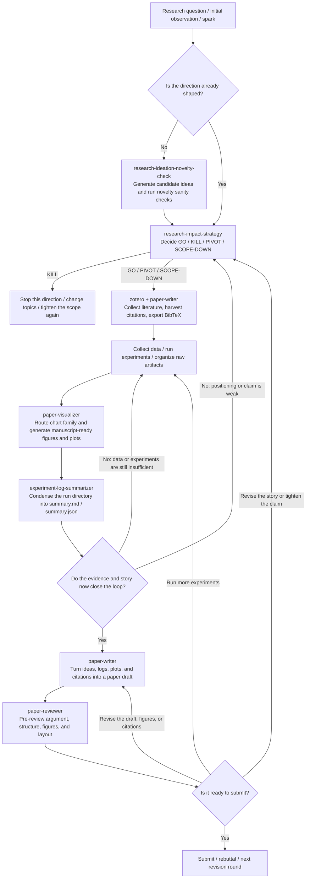

# Skills Repository

[](./.codex-plugin/plugin.json)
[](./.claude-plugin/marketplace.json)
[](./skills)
[](./skills)
[](./README.md#showcase-end-to-end-research-workflow)

Use this repository from **Codex**, **Claude Code**, and **OpenClaw** workflows.

This repository keeps installable Agent Skills under a single [`skills/`](./skills) entrypoint, following the layout commonly used by skills repositories such as [openai/skills](https://github.com/openai/skills) and [anthropics/skills](https://github.com/anthropics/skills).

It focuses on project-owned skills that are maintained directly in this repository. Official or third-party skills should stay in their own upstream repositories rather than being vendored here.

## Layout

- [`skills/`](./skills): all discoverable skills
- [`skills/<skill-name>/`](./skills): user-installable skills

## Language Policy

Use precise, professional English throughout this repository unless a skill explicitly concerns another language, such as translation, language-specific writing guidance, or language-specific source code.

## Showcase: End-to-End Research Workflow

This example shows how multiple research-oriented skills in this repository can be composed into one end-to-end workflow instead of being used as isolated point tools.



Recommended minimum loop:

1. [`research-ideation-novelty-check`](./skills/research-ideation-novelty-check/SKILL.md)
2. [`research-impact-strategy`](./skills/research-impact-strategy/SKILL.md)
3. [`zotero`](./skills/zotero/SKILL.md) / [`paper-writer`](./skills/paper-writer/SKILL.md) for bibliography helpers
4. [`paper-visualizer`](./skills/paper-visualizer/SKILL.md)
5. [`experiment-log-summarizer`](./skills/experiment-log-summarizer/SKILL.md)
6. [`paper-writer`](./skills/paper-writer/SKILL.md)
7. [`paper-reviewer`](./skills/paper-reviewer/SKILL.md)

The core point of this showcase is:

- Use `research-impact-strategy` first to decide whether the topic is worth pursuing, instead of drafting the paper immediately.
- Use `paper-visualizer` as the single visualization entry point; it now subsumes chart-family routing and manuscript-ready figure generation.
- Use `experiment-log-summarizer` before writing so the run directory becomes a stable input.
- Use `paper-writer` as the single manuscript-writing entry point; it now covers guided drafting, profile-based LaTeX scaffolds, bibliography harvesting, and figure/caption audit helpers.
- Use `paper-reviewer` before submission to decide whether to add experiments, revise the story, or submit.

## Local Usage

Point your local skill roots at this directory:

- `~/.codex/skills -> /Users/tcztzy/skills/skills`
- `~/.claude/skills -> /Users/tcztzy/skills/skills`

That keeps runtime lookup paths stable for repository-local skills, for example:

- `$CODEX_HOME/skills/skill-manager/scripts/validate-skill.py`
- `$CODEX_HOME/skills/paper-visualizer/scripts/manuscript_figure.py`

If you also need official OpenAI skills such as `playwright`, `pdf`, or `openai-docs`, install them from [openai/skills](https://github.com/openai/skills) or use the built-in system skills that ship with Codex.

## Codex Plugin

This repository now exposes a native Codex plugin via [`.codex-plugin/plugin.json`](./.codex-plugin/plugin.json) and [`.agents/plugins/marketplace.json`](./.agents/plugins/marketplace.json).

If you open this repository in the Codex app, you can install it from the repo marketplace without copying skills into `.agents/skills`:

1. Download the Codex app
   - macOS (Apple Silicon): [Download Codex.dmg](https://persistent.oaistatic.com/codex-app-prod/Codex.dmg)
   - Windows: [Install from Microsoft Store](https://apps.microsoft.com/detail/9plm9xgg6vks?hl=en-US&gl=US) or run `winget install Codex -s msstore`
2. Open Codex and sign in with your ChatGPT account.
3. Clone this repository locally and open it in the Codex app.
4. Restart Codex if the repository was already open before the marketplace files were added.
5. Open the plugin directory, choose the `Blackscience Tech Skills` marketplace, and install the `Blackscience Tech Skills` plugin.

The plugin packages the repository's [`skills/`](./skills) directory directly, so adding or updating skills in this repo updates the local plugin source as well.

## Codex App Quickstart (Remote Install Alternative)

If you do not want to clone this repository locally first, install skills from the repository URL with `skill-installer`.

Paste one of the following prompts into Codex:

```text
Use $skill-installer to install skills from https://github.com/tcztzy/skills.
```

If you only want one skill, ask for it explicitly:

```text
Use $skill-installer to install the `skill-manager` skill from https://github.com/tcztzy/skills.
```

If a newly installed skill does not appear immediately, restart Codex.

## Claude Marketplace

This repository also exposes a Claude plugin marketplace manifest at [`.claude-plugin/marketplace.json`](./.claude-plugin/marketplace.json).

- Each visible skill under [`skills/`](./skills) is exported as its own Claude plugin entry.
- Hidden and system-only directories are excluded from the marketplace manifest.
- The manifest is generated by [`scripts/generate_claude_marketplace.py`](./scripts/generate_claude_marketplace.py).

Regenerate it after adding, removing, or renaming skills:

```bash
python3 scripts/generate_claude_marketplace.py
```

After the repository is pushed, Claude Code can add it as a marketplace from GitHub and enable individual skill plugins through `enabledPlugins`.
