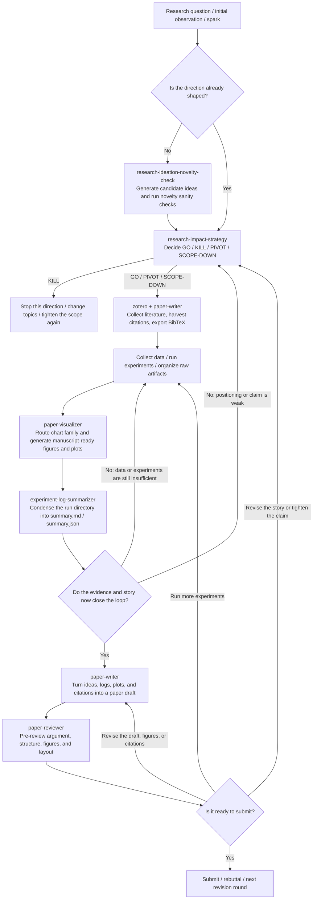

# Blackscience Tech Skills

[](./.codex-plugin/plugin.json)
[](./.claude-plugin/marketplace.json)
[](./skills)
[](./skills)
[](./README.md#research-workflow)

Task-first agent skills for research, evaluation, developer tooling, and document workflows.

This repository distributes the same [`skills/`](./skills) tree in three practical ways:

- as a native Codex repo plugin
- as a generated Claude Code marketplace
- as a plain local skills directory for tools that read skill roots directly

The repository is intentionally project-owned. First-party skills live here; official or third-party skills should stay in their own upstream repositories instead of being vendored into this tree.

## At a Glance

| Item | Value |
| --- | --- |
| Main skill root | [`skills/`](./skills) |
| Codex distribution | [`.codex-plugin/plugin.json`](./.codex-plugin/plugin.json) + [`.agents/plugins/marketplace.json`](./.agents/plugins/marketplace.json) |
| Claude Code distribution | [`.claude-plugin/marketplace.json`](./.claude-plugin/marketplace.json) |
| Current catalog size | 24 installable skills |
| Main focus areas | research, evaluation, developer tooling, documents |

## Install

Choose the shortest path for your environment.

### Codex App

Install this repository as a repo-local plugin when you already have the checkout on disk.

1. Clone the repository locally.
2. Open the repository in the Codex app.
3. Restart Codex if the repo was already open before the marketplace files existed.
4. Open the plugin directory, choose the `Blackscience Tech Skills` marketplace, and install the `Blackscience Tech Skills` plugin.

The Codex marketplace entry points at the repository root, so Codex loads [`.codex-plugin/plugin.json`](./.codex-plugin/plugin.json) and the existing [`skills/`](./skills) tree without an extra wrapper directory.

### Codex Remote Install

If you do not want to clone the repository first, install from the GitHub URL with `skill-installer`.

```text
Use $skill-installer to install skills from https://github.com/tcztzy/skills.
```

To install only one skill:

```text
Use $skill-installer to install the `skill-manager` skill from https://github.com/tcztzy/skills.
```

If a newly installed skill does not appear immediately, restart Codex.

### Claude Code Marketplace

This repository also exposes a Claude marketplace manifest at [`.claude-plugin/marketplace.json`](./.claude-plugin/marketplace.json).

After the repository is pushed to GitHub:

1. Add the repository as a marketplace in Claude Code.
2. Enable the individual plugins you want from that marketplace.

The Claude manifest is generated from the installable skill directories under [`skills/`](./skills), so the plugin list stays aligned with the repository contents.

### Manual Local Roots

If you prefer direct filesystem-based loading, point your local skill roots at this repository's [`skills/`](./skills) directory.

```bash
REPO_ROOT=/path/to/tcztzy-skills
ln -sfn "$REPO_ROOT/skills" "$HOME/.codex/skills"
ln -sfn "$REPO_ROOT/skills" "$HOME/.claude/skills"
```

That keeps skill lookup stable for repository-local helpers such as:

- `$CODEX_HOME/skills/skill-manager/scripts/validate-skill.py`
- `$CODEX_HOME/skills/paper-visualizer/scripts/manuscript_figure.py`

The same layout is also suitable for OpenClaw-compatible workflows that read a `skills/` directory directly.

## Skill Map

The catalog is organized around user tasks instead of tool brands.

| Track | What it covers | Representative skills |
| --- | --- | --- |
| Research strategy | idea generation, novelty checks, go/kill/pivot decisions | [`research-ideation-novelty-check`](./skills/research-ideation-novelty-check/SKILL.md), [`research-impact-strategy`](./skills/research-impact-strategy/SKILL.md) |
| Paper production | literature, figures, drafting, review, translation | [`zotero`](./skills/zotero/SKILL.md), [`paper-writer`](./skills/paper-writer/SKILL.md), [`paper-visualizer`](./skills/paper-visualizer/SKILL.md), [`paper-reviewer`](./skills/paper-reviewer/SKILL.md), [`academic-zh-en-translation`](./skills/academic-zh-en-translation/SKILL.md) |
| Experiment and evaluation | run preparation, execution, scoring, post-run summaries | [`bfts-config-prep`](./skills/bfts-config-prep/SKILL.md), [`experiment-bfts-runner`](./skills/experiment-bfts-runner/SKILL.md), [`experiment-log-summarizer`](./skills/experiment-log-summarizer/SKILL.md), [`benchmark-builder`](./skills/benchmark-builder/SKILL.md), [`answer-judging`](./skills/answer-judging/SKILL.md), [`token-cost-tracker`](./skills/token-cost-tracker/SKILL.md) |
| Engineering and systems | code simplification, performance, infra, batch systems, ACP, environment handling | [`code-simplifier`](./skills/code-simplifier/SKILL.md), [`project-simplify`](./skills/project-simplify/SKILL.md), [`python-performance-tuning`](./skills/python-performance-tuning/SKILL.md), [`hpc-batch`](./skills/hpc-batch/SKILL.md), [`nix`](./skills/nix/SKILL.md), [`wsl-fs`](./skills/wsl-fs/SKILL.md), [`agent-client-protocol`](./skills/agent-client-protocol/SKILL.md) |
| Authoring and workflow maintenance | skill authoring, format conversion, document authoring, hiring research | [`skill-manager`](./skills/skill-manager/SKILL.md), [`latex-to-word`](./skills/latex-to-word/SKILL.md), [`typst`](./skills/typst/SKILL.md), [`career-team-intel`](./skills/career-team-intel/SKILL.md) |

<details>
<summary>Full installable catalog</summary>

### Research and paper workflows

- [`academic-zh-en-translation`](./skills/academic-zh-en-translation/SKILL.md): academic Chinese-English translation with fidelity and discipline-aware wording
- [`paper-reviewer`](./skills/paper-reviewer/SKILL.md): bounded academic paper review with structured outputs
- [`paper-visualizer`](./skills/paper-visualizer/SKILL.md): publication-grade figures, plots, and diagrams
- [`paper-writer`](./skills/paper-writer/SKILL.md): drafting, revising, scaffolding, citation harvesting, and figure QA
- [`research-ideation-novelty-check`](./skills/research-ideation-novelty-check/SKILL.md): idea generation and lightweight novelty sanity checks
- [`research-impact-strategy`](./skills/research-impact-strategy/SKILL.md): go/kill/pivot/scope-down decisions for research directions
- [`zotero`](./skills/zotero/SKILL.md): literature capture, collection management, and bibliography export

### Experiment and evaluation workflows

- [`answer-judging`](./skills/answer-judging/SKILL.md): response quality judging from thread-only evidence
- [`benchmark-builder`](./skills/benchmark-builder/SKILL.md): benchmark items, rubrics, evaluators, and release protocols
- [`bfts-config-prep`](./skills/bfts-config-prep/SKILL.md): prepare runnable BFTS experiment directories
- [`experiment-bfts-runner`](./skills/experiment-bfts-runner/SKILL.md): execute the standalone BFTS experiment pipeline
- [`experiment-log-summarizer`](./skills/experiment-log-summarizer/SKILL.md): grounded summaries of run directories and artifacts
- [`token-cost-tracker`](./skills/token-cost-tracker/SKILL.md): summarize token usage and cost logs

### Engineering, infra, and environment workflows

- [`agent-client-protocol`](./skills/agent-client-protocol/SKILL.md): implement or debug ACP integrations
- [`code-simplifier`](./skills/code-simplifier/SKILL.md): simplify code while keeping quality gates
- [`hpc-batch`](./skills/hpc-batch/SKILL.md): troubleshoot Slurm or LSF jobs, arrays, and stuck queues
- [`nix`](./skills/nix/SKILL.md): write and debug Nix language and flake workflows
- [`project-simplify`](./skills/project-simplify/SKILL.md): de-vendor large dependencies and replace them with pinned artifacts
- [`python-performance-tuning`](./skills/python-performance-tuning/SKILL.md): profile-first Python runtime and memory optimization
- [`wsl-fs`](./skills/wsl-fs/SKILL.md): operate on repositories living inside WSL filesystems

### Documents, authoring, and workflow maintenance

- [`career-team-intel`](./skills/career-team-intel/SKILL.md): public-signal team and hiring research for job seeking
- [`latex-to-word`](./skills/latex-to-word/SKILL.md): automated LaTeX-to-Word conversion with preprocessing
- [`skill-manager`](./skills/skill-manager/SKILL.md): create, audit, validate, convert, and inventory skills
- [`typst`](./skills/typst/SKILL.md): draft, convert, debug, and validate Typst documents

</details>

## Research Workflow

The repository is strongest when multiple research-oriented skills are composed into one loop instead of used as isolated one-off tools.



Recommended minimum loop:

1. [`research-ideation-novelty-check`](./skills/research-ideation-novelty-check/SKILL.md)
2. [`research-impact-strategy`](./skills/research-impact-strategy/SKILL.md)
3. [`zotero`](./skills/zotero/SKILL.md) or [`paper-writer`](./skills/paper-writer/SKILL.md) for bibliography work
4. [`paper-visualizer`](./skills/paper-visualizer/SKILL.md)
5. [`experiment-log-summarizer`](./skills/experiment-log-summarizer/SKILL.md)
6. [`paper-writer`](./skills/paper-writer/SKILL.md)
7. [`paper-reviewer`](./skills/paper-reviewer/SKILL.md)

The intended operating model is:

- decide whether the story is worth pursuing before drafting
- summarize experiment artifacts before turning them into prose
- use one visualization entry point instead of splitting by plotting backend
- use one manuscript-writing entry point instead of fragmenting adjacent paper tasks
- run a bounded review pass before submission

## Repository Layout

- [`skills/`](./skills): all discoverable skills
- [`skills/<skill-name>/`](./skills): installable skills when the directory contains `SKILL.md`
- helper-only directories may exist under [`skills/`](./skills) without being exported as installable entries

## Metadata and Maintenance

Repository metadata is split by consumer:

- [`.codex-plugin/plugin.json`](./.codex-plugin/plugin.json): native Codex plugin manifest
- [`.agents/plugins/marketplace.json`](./.agents/plugins/marketplace.json): Codex marketplace entry for this repository
- [`.claude-plugin/marketplace.json`](./.claude-plugin/marketplace.json): Claude marketplace manifest generated from skill metadata

Regenerate the Claude marketplace after adding, removing, renaming, or updating installable skills:

```bash
python3 scripts/generate_claude_marketplace.py
```

Validate both Codex and Claude plugin metadata before pushing:

```bash
python3 scripts/validate_plugin_metadata.py
```

## Repository Conventions

- Use precise, professional English unless a skill is explicitly language-specific.
- Keep top-level skills task-first rather than tool-first whenever possible.
- Keep upstream official skills such as `playwright`, `pdf`, or `openai-docs` in their original source repositories or use the built-in system skills that ship with Codex.
