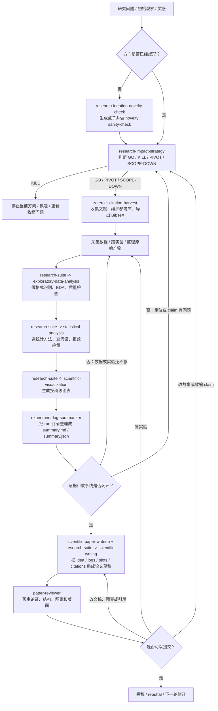

# Skills Repository

This repository keeps installable Agent Skills under a single [`skills/`](./skills) entrypoint, following the layout used by [openai/skills](https://github.com/openai/skills) and [anthropics/skills](https://github.com/anthropics/skills).

It intentionally does not duplicate official skills that already exist in `openai/skills`. OpenAI-owned curated/system skills should come from the upstream repository or Codex's built-in system skill set; this repository focuses on project-owned skills plus non-OpenAI vendored suites.

## Layout

- [`skills/`](./skills): all discoverable skills
- [`skills/<skill-name>/`](./skills): user-installable skills

## Showcase: 科研全流程

下面这个例子展示了如何把仓库里的多个科研技能串成一个端到端工作流，而不是把它们当成彼此割裂的单点工具。



推荐的最小闭环：

1. [`research-ideation-novelty-check`](./skills/research-ideation-novelty-check/SKILL.md)
2. [`research-impact-strategy`](./skills/research-impact-strategy/SKILL.md)
3. [`zotero`](./skills/zotero/SKILL.md) / [`citation-harvest`](./skills/citation-harvest/SKILL.md)
4. [`research-suite`](./skills/research-suite/SKILL.md) 内的 `exploratory-data-analysis`
5. [`research-suite`](./skills/research-suite/SKILL.md) 内的 `statistical-analysis`
6. [`research-suite`](./skills/research-suite/SKILL.md) 内的 `scientific-visualization`
7. [`experiment-log-summarizer`](./skills/experiment-log-summarizer/SKILL.md)
8. [`scientific-paper-writeup`](./skills/scientific-paper-writeup/SKILL.md) / [`research-suite`](./skills/research-suite/SKILL.md) 内的 `scientific-writing`
9. [`paper-reviewer`](./skills/paper-reviewer/SKILL.md)

这个 showcase 的核心意思是：

- 先用 `research-impact-strategy` 判断题值不值得继续，而不是一上来就写论文。
- 把 `research-suite` 当作分析与可视化入口，把 EDA、统计、出图串起来。
- 在写作前用 `experiment-log-summarizer` 把 run 目录沉淀成稳定输入。
- 提交前再用 `paper-reviewer` 做一次预审，决定是补实验、改故事，还是直接投稿。

## Local Usage

Point your local skill roots at this directory:

- `~/.codex/skills -> /Users/tcztzy/skills/skills`
- `~/.claude/skills -> /Users/tcztzy/skills/skills`

That keeps runtime lookup paths stable for repository-local skills, for example:

- `$CODEX_HOME/skills/skill-manager/scripts/validate-skill.py`
- `$CODEX_HOME/skills/data-to-viz/scripts/gen_matplotlib_skeleton.py`

If you also need official OpenAI skills such as `playwright`, `pdf`, or `openai-docs`, install them from [openai/skills](https://github.com/openai/skills) or use the built-in system skills that ship with Codex.

## Codex App Quickstart (macOS / Windows)

If you want the easiest first-run path in the Codex app, install skills from this repository URL first instead of wiring local symlinks.

1. Download the Codex app
   - macOS (Apple Silicon): [Download Codex.dmg](https://persistent.oaistatic.com/codex-app-prod/Codex.dmg)
   - Windows: [Install from Microsoft Store](https://apps.microsoft.com/detail/9plm9xgg6vks?hl=en-US&gl=US) or run `winget install Codex -s msstore`
2. Open Codex and sign in with your ChatGPT account.
3. Open any local folder or git repository in the Codex app.
4. Paste one of the following prompts into Codex to install skills from this repository:

```text
Use $skill-installer to install skills from https://github.com/tcztzy/skills.
```

```text
请用 $skill-installer 从 https://github.com/tcztzy/skills 安装这个仓库里的技能。
```

If you only want one skill, ask for it explicitly:

```text
Use $skill-installer to install the `skill-manager` skill from https://github.com/tcztzy/skills.
```

If a newly installed skill does not appear immediately, restart Codex.

Why this path:

- Codex repo-local auto-discovery expects skills under `.agents/skills`.
- This repository keeps installable skills under [`skills/`](./skills) as a shared skill source.
- For Codex app beginners, installing from the repository URL is the simplest setup.

## Claude -> Codex Projection

If you want Codex to mirror Claude's enabled skill plugins instead of exposing the whole repository, use [`scripts/sync_codex_skills_from_claude.py`](./scripts/sync_codex_skills_from_claude.py).

The script:

- reads `~/.claude/settings.json`
- resolves enabled plugin ids like `document-skills@anthropic-agent-skills`
- loads the corresponding marketplace metadata from `~/.claude/plugins/marketplaces/*/.claude-plugin/marketplace.json`
- ignores non-skill plugins
- creates symlinks for enabled skills under `~/.codex/skills`

Example:

```bash
python3 scripts/sync_codex_skills_from_claude.py --dry-run
python3 scripts/sync_codex_skills_from_claude.py --replace-symlink
```

`--replace-symlink` is needed if `~/.codex/skills` is currently a direct symlink to this repository, because the enabled-only projection needs a managed directory instead of a pass-through root symlink.

## Claude Marketplace

This repository now also exposes a Claude plugin marketplace manifest at [`.claude-plugin/marketplace.json`](./.claude-plugin/marketplace.json).

- Each visible skill under [`skills/`](./skills) is exported as its own Claude plugin entry.
- Hidden and system-only directories are excluded from the marketplace manifest.
- The manifest is generated by [`scripts/generate_claude_marketplace.py`](./scripts/generate_claude_marketplace.py).

Regenerate it after adding, removing, or renaming skills:

```bash
python3 scripts/generate_claude_marketplace.py
```

After the repository is pushed, Claude Code can add it as a marketplace from GitHub and enable individual skill plugins through `enabledPlugins`.
