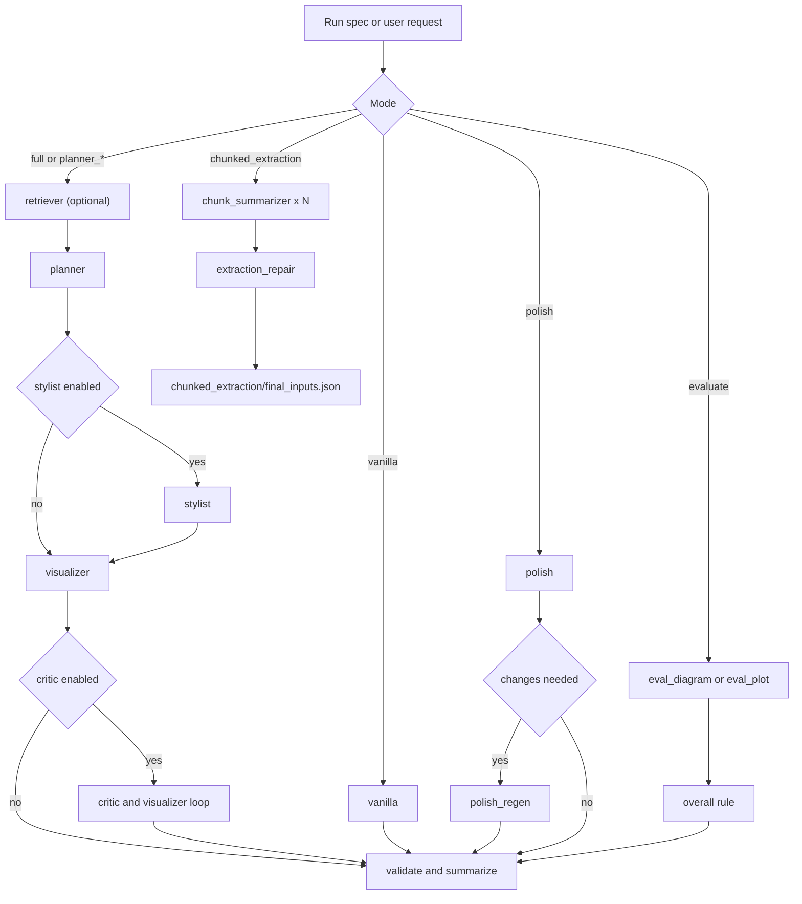

# Paper Visualizer Workflow Orchestrator

## Overview

Use this skill when the task is to run or analyze a `paper-visualizer` paper-visualization workflow.
This skill is self-contained. It does not require the Python `datav` package or repository-local helpers.

Treat this skill's packaged `agents/`, `references/`, `scripts/`, and `assets/` as the source of truth for both workflow contracts and deterministic helper behavior.

## When to Use

- Use this skill when the user explicitly wants `paper-visualizer`, a PaperBananaBench workflow, a self-contained `datav`-free paper-visualization pipeline, or a run artifact layout under `runs/paper-visualizer/`.
- Use this skill when the user gives a manuscript path such as `main.tex`, `paper.md`, `paper.typ`, or `draft.docx` and wants a simple prompt like `paper-visualizer main.tex 绘制 图 1`.
- Use this skill when the request mentions `full`, `planner`, `planner_stylist`, `planner_critic`, `vanilla`, `polish`, `evaluate`, or `chunked_extraction`.
- Use this skill when the job is to generate or evaluate a `diagram` or `plot` with the packaged stage workers, style guides, validators, and run summaries in this skill.
- Do not use this skill for generic charting, arbitrary image editing, or `refine`; this skill is only for the bundled `paper-visualizer` workflow contracts.

## Workflow Decision Tree

- If the request is `full`, `planner_critic`, `planner_stylist`, `planner`, `vanilla`, or `polish`, read [`references/workflows.md`](references/workflows.md) and [`references/agent-map.md`](references/agent-map.md).
- If the request is `evaluate`, also read [`references/evaluation.md`](references/evaluation.md).
- If the request is `chunked_extraction`, read [`references/workflows.md`](references/workflows.md) and the chunked extraction section in [`references/agent-map.md`](references/agent-map.md), but treat it as experimental.
- If the request contains a manuscript path plus a target figure number, prefer the end-to-end runner at `scripts/manuscript_figure.py` instead of manually orchestrating planner/stylist/visualizer stages one by one.
- Do not default to `refine`; this skill does not ship a refine/image-edit backend.

## Common Flows

- `full` or `planner_*`: use this when you want to generate a new diagram or plot from source content, optionally with retrieval, styling, and critic iterations.
- `manuscript figure`: use this when you want one command to read a manuscript, extract the relevant Figure context, pick a style guide from the manuscript domain, generate a diagram with Gemini, save it locally, and insert it back into the manuscript when the format supports it.
- `vanilla`: use this for the shortest generation path when you want one direct render and do not need retrieval, styling, or critic loops.
- `polish`: use this when you already have a benchmark image and want style suggestions plus optional regeneration.
- `evaluate`: use this when you already have a generated image artifact and want per-dimension comparison plus deterministic overall scoring.
- `chunked_extraction`: use this only for long-source preprocessing, where chunk summaries are merged and repaired into `content` plus `visual_intent`.



## Input -> Actions -> Output

- Input:
  - for end-to-end manuscript runs: manuscript path, target figure number, and optional model/style overrides
  - `mode` and `task` (`diagram` or `plot`)
  - a writable working directory
  - source content, benchmark asset, or pre-split chunks depending on mode
  - optional `workflow_spec.json`; otherwise create a minimal one in the run directory
- Actions:
  - for manuscript runs: read the manuscript, resolve `\input` / `\include` for LaTeX, extract caption + figref + method context, auto-select the most relevant packaged style guide, call Gemini text refinement and image generation through `scripts/manuscript_figure.py`, save the generated image under the manuscript repo, and rewrite the manuscript at the target figure location when supported
  - choose the relevant references for the requested mode
  - resolve dataset or style-guide assets if needed
  - run the packaged stage workers and persist intermediate files in the run directory
  - validate the run with `scripts/validate_run.py`
  - summarize the run with `scripts/summarize_run.py`
- Output:
  - a JSON object with `mode`, `task`, `status`, `run_dir`, `artifacts`, and `notes`
  - persistent artifacts rooted under `runs/paper-visualizer/<run_id>/`

## Preconditions

- Verify the current working directory is writable before doing workflow work.
- Verify these skill assets exist before proceeding:
  - `scripts/manuscript_figure.py`
  - `agents/`
  - `references/`
  - `scripts/resolve_paperbanana.py`
  - `scripts/render_plot.py`
  - `scripts/compute_overall.py`
  - `scripts/validate_run.py`
  - `scripts/summarize_run.py`
  - optional benchmark assets under `assets/paperbanana/`
  - `assets/style_guides/neurips2025_diagram_style_guide.md`
  - `assets/style_guides/neurips2025_plot_style_guide.md`
- Treat `scripts/render_plot.py` as a trusted-code boundary because it executes Python plot code. Only run it on code generated inside the current `paper-visualizer` workflow or on user-confirmed trusted input.
- Treat `scripts/manuscript_figure.py` as the preferred trusted-code boundary for simple `paper-visualizer <manuscript> 绘制 图 N` requests.
- Keep all persistent artifacts inside a run directory under the current working directory. Default to `runs/paper-visualizer/<run_id>/`.
- If the user did not provide a workflow spec, write a minimal `workflow_spec.json` into the run directory with the fields the run actually uses. The validators in this skill require that file to exist, but they do not depend on an external schema.
- Runtime stages load style guides from `assets/style_guides/`.
- End-to-end manuscript runs should call `load_dotenv()` first, then rely on the Gemini SDK default credential lookup. `scripts/manuscript_figure.py` should not manually read `GEMINI_API_KEY` or pass it into `genai.Client(...)`.
- Use the packaged dataset resolver at `scripts/resolve_paperbanana.py` and pass the returned directory explicitly to stages that need benchmark files.
  The resolver only has three priority levels: explicit `--dataset-dir`, `assets/paperbanana/`, then the current working directory target `data/PaperBananaBench/` with download as the final fallback inside that target.
- If a packaged style guide asset is missing or stale, repair the matching file under `assets/style_guides/` before running stylist, polish, or the manuscript runner. Style guides should be selected from manuscript context first, then fall back to a general guide only when no domain guide matches.
- Do not claim support for helpers or files that are not bundled with this skill.

## Core Rules

- This skill's packaged agents, scripts, and assets define stage behavior.
- Use the packaged stage workers in this skill's `agents/` directory rather than inventing new stage names.
- Pass explicit task labels (`diagram` or `plot`) to every stage worker. Never let a worker infer task type.
- Mirror the actual in-memory data keys used by the stage contracts in this skill:
  - retriever: `top10_references`, optional `retrieved_examples`
  - planner: `target_<task>_desc0`
  - stylist: `target_<task>_stylist_desc0`
  - visualizer: `..._image`, and for plots also `..._code`
  - critic: `target_<task>_critic_suggestions<N>`, `target_<task>_critic_desc<N>`
  - vanilla: `vanilla_<task>_image`
  - polish: `suggestions_<task>`, `polished_<task>_image`
- Prefer file-based handoff over conversational summaries. If a stage result matters downstream, write it into the run directory before invoking the next stage.
- Treat the current workflow as single-candidate unless you explicitly build extra fan-out outside the packaged agents. Default to `candidates/candidate_00/`.
- The current visualizer contract supports critic rounds `0..2`, so cap critic rerenders at 3 unless the skill changes.
- Provide `additional_info.rounded_ratio` for diagram and polish render paths, and preferably for vanilla diagram runs.
- Reuse the packaged helpers instead of inventing new ones:
  - `scripts/manuscript_figure.py`
  - `scripts/render_plot.py`
  - `scripts/compute_overall.py`
  - `scripts/resolve_paperbanana.py`
- For a simple manuscript request, prefer running:
  `uv run --script skills/paper-visualizer/scripts/manuscript_figure.py <manuscript> --figure <N>`
- Before returning success, run the packaged `scripts/validate_run.py` against the run directory, then run `scripts/summarize_run.py` and return its JSON verbatim or with the same shape.

## Mode Execution

### Generation Modes

### Manuscript Figure Runner

- Use `scripts/manuscript_figure.py` for the simplest end-to-end manuscript path.
- Preferred invocation:
  `uv run --script skills/paper-visualizer/scripts/manuscript_figure.py main.tex --figure 1`
- The runner currently prioritizes `.tex` as the strongest insertion path. It also reads `.md`, `.typ`, `.typst`, and `.docx`, but automatic rewrite is only guaranteed for `.tex`, `.md`, and `.typ` / `.typst`.
- The runner must:
  - create `runs/paper-visualizer/<run_id>/`
  - write `workflow_spec.json`
  - write `shared/manuscript_context.json`
  - write `shared/diagram_plan.json`
  - write `candidates/candidate_00/planner_draft.txt`
  - write `candidates/candidate_00/planner.txt`
  - write the rendered image artifact under `candidates/candidate_00/`
  - save the manuscript-facing image under the manuscript repo, typically `figures/paper_visualizer/`
  - update the manuscript in place when the format supports it and insertion succeeds
- The runner should auto-select style guides from manuscript context, for example bioinformatics-specific guides when the extracted content is clearly biological, and fall back to a general guide only if no domain guide matches.
- Use `--draft-only` when you want extraction and prompt generation without image generation or manuscript rewrite.

- For `full`:
  - Resolve the benchmark dataset with the packaged `scripts/resolve_paperbanana.py` and pass the resulting directory explicitly downstream.
  - If retrieval assets are unavailable, fall back to `retrieval_setting=none` instead of hard-failing.
  - `manual` retrieval is only meaningful for `diagram`; for `plot`, treat it as no references.
  - Run retriever once and write `shared/retrieval.json`.
  - Run planner and write `candidates/candidate_00/planner.txt`.
  - Render planner output. For plots, persist both code and rendered image when available. For diagrams, persist the rendered image.
  - If stylist is enabled, load `assets/style_guides/neurips2025_<task>_style_guide.md`, write `stylist.txt`, and render the stylist output too.
  - If critic is enabled, use `stylist` as the round-0 source when stylist ran, otherwise use `planner`.
  - If a critic round returns `No changes needed.`, reuse the previous successful image instead of rerendering a no-op round.
- For `planner_critic`:
  - Run planner, render it, then run the critic loop with `source=planner`.
- For `planner_stylist`:
  - Run planner, stylist, and render both outputs.
- For `planner`:
  - Run planner and render it.
- For `vanilla`:
  - Provide `additional_info.rounded_ratio` for diagram runs, and preferably for any workflow that needs consistent image sizing.
  - Write the rendered artifact under `candidates/candidate_00/`.
  - For `plot`, note that the stable downstream artifact is the rendered image, not an intermediate matplotlib code file.

### Polish

- Input data must include `path_to_gt_image` relative to the benchmark task directory.
- Load `assets/style_guides/neurips2025_<task>_style_guide.md`.
- Write `polish/suggestions.txt` first.
- If suggestions are `No changes needed`, skip regeneration and carry the original image path forward in `notes`.
- If regenerating, honor `additional_info.rounded_ratio` when available.

### Evaluation

- Use the skill's four model-evaluated dimensions only:
  - `faithfulness`
  - `conciseness`
  - `readability`
  - `aesthetics`
- Write those four JSON files under `evaluation/`.
- Compute `overall` deterministically with `scripts/compute_overall.py` instead of spending another model call.
- If the evaluated image artifact is missing or invalid, treat the sample as a Human win.

### Chunked Extraction (Experimental)

- Only use when the user explicitly asks for chunked extraction or provides pre-split chunks.
- This skill does not ship a native chunked-extraction runner; the packaged workers are orchestration helpers only.
- Write the canonical output to `chunked_extraction/final_inputs.json`.
- Prefer the canonical keys in that file:
  - `content`
  - `visual_intent`
- If a downstream consumer also wants a caption alias, duplicate `visual_intent` rather than making a different schema primary.

### Unsupported in Paper Visualizer

- Do not advertise or default to `refine`. This skill does not implement a refine/image-edit backend.

## Output Contract

- Return JSON with the same shape produced by `scripts/summarize_run.py`.
- Always include:
  - `mode`
  - `task`
  - `status`
  - `run_dir`
  - `artifacts`
  - `notes`
- Prefer relative artifact paths rooted at the current working directory.
- If validation fails, return `status: "failed"` and explain the missing artifact or contract break in `notes`.

## Resources

- `references/workflows.md`
  Use for mode-by-mode sequencing, support levels, artifact layout, and stop conditions.
- `references/agent-map.md`
  Use for stage selection, actual data keys, and file naming conventions.
- `references/evaluation.md`
  Use for evaluation dimensions and the deterministic overall rule.
- `assets/style_guides/*.md`
  Packaged style-guide assets consumed by stylist, polish, and `scripts/manuscript_figure.py`. Prefer domain-specific guides that match the manuscript context, then fall back to a general guide only when needed. Relevant examples include `neurips2025_<task>_style_guide.md`, `bioinformatics_diagram_style_guide.md`, `bioinformatics_plot_style_guide.md`, and `bioinformatics_visual_style_guide.md`.
- `scripts/manuscript_figure.py`
  Use for end-to-end manuscript figure generation: extract manuscript context, summarize and refine the prompt with Gemini, generate the diagram image, save it locally, and rewrite the manuscript when supported.
- `assets/paperbanana/`
  Optional packaged benchmark assets. Prefer `assets/paperbanana/PaperBananaBench/` when bundling the extracted dataset, or `assets/paperbanana/PaperBananaBench.zip` when bundling only the archive.
- `agents/*.toml`
  Source of truth for stage behavior and worker contracts.
- `scripts/resolve_paperbanana.py`
  Use for dataset resolution, extraction, and fallback behavior.
- `scripts/render_plot.py`
  Use for plot rendering semantics.
- `scripts/compute_overall.py`
  Use for deterministic overall aggregation.
- `scripts/validate_run.py`
  Run before returning success.
- `scripts/summarize_run.py`
  Run to produce the canonical JSON summary for the final response.

## Example

User request:

```text
paper-visualizer main.tex 绘制 图 1
```

Expected behavior:

- write a run directory such as `runs/paper-visualizer/<run_id>/`
- create `workflow_spec.json`
- run `uv run --script skills/paper-visualizer/scripts/manuscript_figure.py main.tex --figure 1`
- extract the manuscript context for Figure 1
- auto-select a style guide from the manuscript domain instead of hard-coding one general guide
- generate the image and save it locally
- rewrite the manuscript at the target figure location when insertion succeeds
- validate the run and return the JSON summary shape from `scripts/summarize_run.py`

## Final Check

- Ensure the run directory contains `workflow_spec.json`.
- Ensure the expected subdirectories exist for the chosen mode.
- Ensure every artifact path mentioned in the final JSON exists on disk.
- Ensure manuscript runs record which style guides were chosen from context.
- Ensure manuscript insertion notes are recorded in the final JSON `notes` field.
- Ensure plot runs do not claim code artifacts for `vanilla`, because this skill only guarantees `vanilla_<task>_image` downstream.
- Ensure `evaluation/overall.json` is derived from the four per-dimension outcomes, not from a fifth model call.
- Ensure the final response is the exact stdout of `scripts/summarize_run.py` or a JSON object with the same shape.
